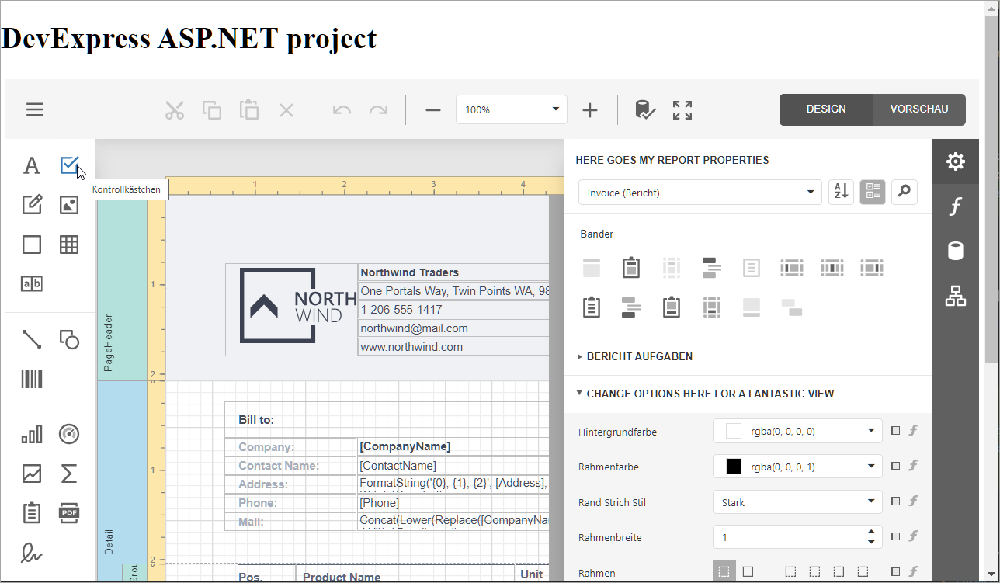

<!-- default badges list -->

<!-- default badges end -->
# Reporting for Web Forms - Report Designer and Document Viewer Localization

This example shows how to apply German localization to report controls in an ASP.NET Web Forms application and change UI texts.

The project specifies the culture of the application using the **Culture** and **UICulture** parameters in the [GlobalizationSection](https://docs.microsoft.com/en-us/dotnet/api/system.web.configuration.globalizationsection). Localized texts are automatically obtained from the satellite resource assemblies in the `de' folder. 

The application handles the `CustomizeLocalization` event of the client-side report control to adjust the translation. The script on the page calls the **UpdateLocalization** method to specify the text for the localization strings.

## Files to Review

* [Designer.aspx](CS/SubstituteLocalizationStringsExample/Designer.aspx) (VB: [Designer.aspx](VB/SubstituteLocalizationStringsExample/Designer.aspx))
* [Viewer.aspx.cs](CS/SubstituteLocalizationStringsExample/Viewer.aspx.cs) (VB: [Viewer.aspx.vb](VB/SubstituteLocalizationStringsExample/Viewer.aspx.vb))
* [Web.config](CS/SubstituteLocalizationStringsExample/Web.config) (VB: [Web.config](VB/SubstituteLocalizationStringsExample/Web.config) )

## Documentation

* [Web Document Viewer - Localization](https://docs.devexpress.com/XtraReports/116315/create-end-user-reporting-applications/web-reporting/asp-net-webforms-reporting/document-viewer/localization)
* [Web End-User Report Designer - Localization](https://docs.devexpress.com/XtraReports/400229/create-end-user-reporting-applications/web-reporting/asp-net-webforms-reporting/end-user-report-designer/localization)

## More Examples

- [How to Localize the Reporting Controls in an Angular JavaScript Application](https://github.com/DevExpress-Examples/how-to-localize-angular-reporting-controls)
- [How to Localize the Reporting Controls in a JavaScript Application with Knockout Bindings](https://github.com/DevExpress-Examples/how-to-localize-javascript-reporting-controls)
